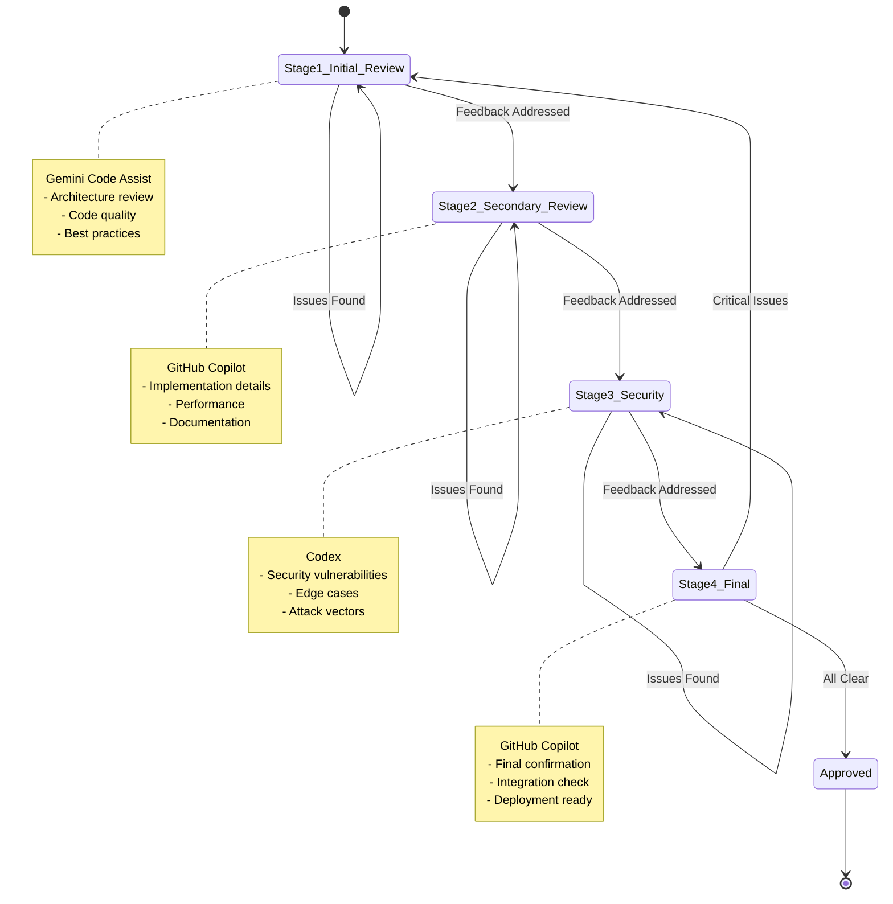

# Agent Operations (AgentOps) Guide

## Overview

This document describes the AI-assisted development workflow for MathProtocol. It outlines how multiple AI agents (GitHub Copilot, Gemini, Codex) collaborate on code reviews, feature implementation, and security analysis through a structured orchestration system.

## Philosophy

**Human-in-the-Loop AI Development**

MathProtocol uses AI agents as **expert consultants**, not autonomous developers:
- Humans define requirements and make final decisions
- AI agents provide analysis, suggestions, and implementation
- Multi-agent review ensures comprehensive coverage
- Orchestrator coordinates without bottlenecks

## Agent Roles

### GitHub Copilot (Primary Implementation)
- **Specialty**: Code generation, implementation
- **Tasks**: Feature development, refactoring, documentation
- **Tools**: Full repository access, all development tools
- **Context**: Deep understanding of codebase patterns

### Gemini Code Assist (Security Analysis)
- **Specialty**: Security review, vulnerability detection
- **Tasks**: Security audits, compliance checks, threat modeling
- **Tools**: Read access, security scanners
- **Context**: OWASP, NIST, HIPAA knowledge

### Codex (Edge Case & Integration)
- **Specialty**: Edge cases, integration testing
- **Tasks**: Test coverage, API compatibility, corner cases
- **Tools**: Testing frameworks, API clients
- **Context**: External system integration

## Review Workflow

### State Machine



### Stage 1: Initial Review (Gemini)

**Focus**: Architecture and Code Quality

**Checklist**:
- [ ] Architecture follows documented patterns
- [ ] Code adheres to style guide (PEP 8)
- [ ] Functions have type hints and docstrings
- [ ] No obvious logic errors
- [ ] Appropriate abstractions and modularity

**Example Feedback**:
```markdown
📐 Architecture: ✅ Follows DataAirlock pattern
🎨 Style: ⚠️  Missing type hints on line 45
📝 Docs: ⚠️  Function `process_request` needs docstring
🧩 Logic: ✅ Input validation looks correct
```

**Resolution**:
- Developer addresses feedback
- Adds 👍 reaction to resolved comments
- Agent verifies fixes in next iteration

### Stage 2: Secondary Review (Copilot)

**Focus**: Implementation Details and Performance

**Checklist**:
- [ ] Efficient algorithms (no O(n²) where O(n) exists)
- [ ] Proper error handling
- [ ] Resource cleanup (file handles, connections)
- [ ] Test coverage for new code
- [ ] Documentation updated

**Example Feedback**:
```markdown
⚡ Performance: ⚠️  Line 67 - Use dict lookup instead of linear search
🛡️  Error Handling: ⚠️  Add try-catch around LLM call
🧪 Tests: ❌ No test for honeypot trigger scenario
📚 Docs: ✅ README updated correctly
```

### Stage 3: Security & Edge Cases (Codex)

**Focus**: Security Vulnerabilities and Corner Cases

**Checklist**:
- [ ] No injection vulnerabilities (SQL, code, prompt)
- [ ] Input validation comprehensive
- [ ] No hardcoded secrets
- [ ] Edge cases handled (empty input, max length, special chars)
- [ ] Rate limiting and DDoS protection

**Example Feedback**:
```markdown
🔒 Security: ⚠️  PHI regex doesn't catch international phone formats
🚨 Injection: ✅ Protocol validation prevents injection
🔑 Secrets: ✅ No hardcoded credentials found
🎯 Edge Cases: ❌ What if context is 10MB? Need size limit
⏱️  Rate Limit: ⚠️  Consider adding per-IP rate limiting
```

### Stage 4: Final Confirmation (Copilot)

**Focus**: Integration and Deployment Readiness

**Checklist**:
- [ ] All previous feedback addressed
- [ ] CI/CD passing (tests, lints, builds)
- [ ] No merge conflicts
- [ ] Backwards compatible (or migration documented)
- [ ] Deployment plan clear

**Example Feedback**:
```markdown
✅ All Security Issues Resolved
✅ Tests Passing (247/247)
✅ Documentation Complete
✅ Ready for Merge
```

## Feedback Protocol

### Comment Types

**MUST FIX** (❌): Blocks merge
```markdown
❌ MUST FIX: SQL injection vulnerability in user_input handler
```

**SHOULD FIX** (⚠️): Recommended but not blocking
```markdown
⚠️  SHOULD FIX: Consider caching this expensive computation
```

**SUGGESTION** (💡): Nice-to-have
```markdown
💡 SUGGESTION: Could use list comprehension here for readability
```

**PRAISE** (✅): Acknowledge good work
```markdown
✅ EXCELLENT: Clean separation of concerns here
```

### Resolution Keywords

Developers signal resolution by:
1. Adding 👍 reaction to comment, OR
2. Replying with keywords: `fixed`, `resolved`, `addressed`, `done`, `completed`, `updated`

Example:
```markdown
> ⚠️  SHOULD FIX: Add type hints

Developer Reply: "Fixed in commit abc123"
Agent: [Verifies and marks resolved]
```

## Orchestrator System

### GitHub Actions Workflow

**Trigger**: PR open/update, comment created

**Process**:
1. Detect current stage based on bot comment history
2. Count unresolved comments for current stage
3. Update status table in PR
4. If stage complete, signal next agent

**Status Table** (Auto-updated):
```markdown
## 🤖 AI Review Status

| Stage | Bot | Status | Comments | Unresolved |
|-------|-----|--------|----------|------------|
| 1 | Gemini (Initial) | ✅ Complete | 5 | 0 |
| 2 | Copilot (Secondary) | 🔄 In Progress | 3 | 2 |
| 3 | Codex (Security) | ⏳ Pending | 0 | 0 |
| 4 | Copilot (Final) | ⏳ Pending | 0 | 0 |

⚠️  **2 unresolved comment(s)** - Address feedback to proceed
💡 *Add 👍 reaction to comments when addressed*
```

### State Persistence

**Storage**: GitHub PR labels and comments

**Labels**:
- `ai-review-stage-1` - Gemini reviewing
- `ai-review-stage-2` - Copilot secondary
- `ai-review-stage-3` - Codex security
- `ai-review-stage-4` - Copilot final
- `ai-review-approved` - All stages complete

**Detection**: Parse comment timestamps and authors to determine progression

## Feature Request Process

### Issue Template (`.github/ISSUE_TEMPLATE/ai_feature_request.yml`)

**Fields**:
1. **Context & Goal**: What are we building?
2. **Security Constraints**: What are the risks?
3. **Agent Assignment**: Which agent(s) should work on this?

**Example**:
```yaml
name: 🤖 AI Feature Request
description: Request a feature to be implemented by AI Team
title: "[FEAT] Add Rate Limiting"
labels: ["ai-queue", "enhancement"]

body:
  - type: textarea
    id: context
    attributes:
      label: Context & Goal
      description: What are we building?
      placeholder: |
        We need to add rate limiting to prevent DDoS attacks.
        Should limit to 100 requests per minute per IP.
    validations:
      required: true
      
  - type: textarea
    id: security
    attributes:
      label: Security Constraints
      description: What are the risks?
      placeholder: |
        Risk: Without rate limiting, attackers can overwhelm server.
        Mitigation: Use token bucket algorithm with Redis backend.
    validations:
      required: true
      
  - type: dropdown
    id: agent_assignment
    attributes:
      label: Primary Agent
      options:
        - "Codex (Implementation)"
        - "Gemini (Analysis)"
        - "Joint Task Force (Both)"
    validations:
      required: true
```

### Workflow

1. **User creates issue** using template
2. **Orchestrator assigns** to designated agent
3. **Agent analyzes** and creates implementation plan
4. **Agent creates PR** with implementation
5. **Multi-agent review** begins (Stage 1)
6. **Iterate** until approved (Stage 4)
7. **Human approves** final merge

## AI Context Management

### Master Context File (`.github/AI_CONTEXT.md`)

**Purpose**: Single source of truth for all AI agents

**Sections**:
1. **Repository Laws** - Immutable rules
2. **Protocol Specification** - MathProtocol rules
3. **Security Controls** - AEGIS architecture
4. **Code Style** - Conventions and patterns
5. **Testing Strategy** - Test requirements

**Example**:
```markdown
# MathProtocol AI Context

## Repository Laws (Immutable)

1. **Zero Natural Language in Protocol**: TASK and PARAM must be mathematical codes
2. **Classification Tasks = No Payload**: Never violate this rule
3. **Generative Tasks = Must Have Payload**: Always enforce
4. **All Security Events Logged**: No silent failures

## Protocol Specification

### Valid Task Codes (Primes)
2, 3, 5, 7, 11, 13, 17, 19, 23, 29

### Valid Param Codes (Fibonacci)
1, 2, 3, 5, 8, 13, 21, 34, 55, 89

### Trap Codes (Honeypots - DO NOT ASSIGN)
43, 47, 53, 59, 61, 67, 71, 73, 79, 83, 89, 97

## Security Controls

### DataAirlock
- Always redact before LLM
- Patterns: EMAIL, SSN, MRN, PHONE, CREDIT_CARD
- Rehydrate after LLM (generative only)

### Circuit Breaker
- Default threshold: 5 failures
- Default timeout: 60 seconds
- States: CLOSED, OPEN, HALF_OPEN

## Code Style

### Python
- PEP 8 compliant
- Type hints required
- Docstrings required (Google style)
- Max line length: 100

### Security
- Never log PHI/PII
- All inputs validated
- All errors handled
- All events audited
```

### Per-Directory Rules (`.cursorrules`)

**Purpose**: Module-specific guidelines

**Location**: `examples/high_assurance_aegis/.cursorrules`

**Example**:
```markdown
# SCOPE: HIGH ASSURANCE AEGIS MODULE
### 🚨 STRICT MODE ACTIVE

- Zero Hallucination: If unsure, ask the user
- No Mocking in Prod: MockLLM only in tests
- Comments: Reference security controls (e.g., "NIST AU-9")
```

## Metrics and Monitoring

### Review Metrics

**Track**:
- Average review time per stage
- Number of iterations to approval
- Most common feedback categories
- Agent agreement rate

**Example Dashboard**:
```
Stage 1 (Gemini):     Avg 2.3 days, 85% first-pass rate
Stage 2 (Copilot):    Avg 1.7 days, 90% first-pass rate
Stage 3 (Codex):      Avg 3.1 days, 70% first-pass rate (Security)
Stage 4 (Copilot):    Avg 0.8 days, 95% first-pass rate

Total Time to Merge:  Avg 7.9 days
Agent Disagreements:  12% (resolved by human)
```

### Quality Metrics

**Track**:
- Post-merge bugs per PR
- Security issues found in production
- Test coverage changes
- Documentation completeness

**Example**:
```
PRs with AI review:   98% coverage, 0.2 bugs/PR
PRs without AI:       87% coverage, 1.3 bugs/PR

Improvement:          +11% coverage, -85% bugs
```

## Best Practices

### For Developers

1. **Provide Context**: The more context in PR description, the better review
2. **Respond Promptly**: Address feedback quickly to keep momentum
3. **Mark Resolved**: Use 👍 or reply to signal resolution
4. **Ask Questions**: If feedback unclear, ask the agent for clarification
5. **Human Final Say**: Agents are advisors, you make the decision

### For AI Agents

1. **Be Specific**: Point to exact lines and provide examples
2. **Explain Why**: Don't just say "fix this", explain the issue
3. **Prioritize**: Use ❌, ⚠️, 💡 to signal severity
4. **Stay in Scope**: Stage 1 focuses on architecture, not security details
5. **Trust Humans**: If they reject feedback, accept it and move on

### For Orchestrator

1. **Don't Block**: Never prevent humans from proceeding
2. **Surface Issues**: Make unresolved comments visible
3. **Track Progress**: Show clear progression through stages
4. **Enable Communication**: Facilitate agent-to-agent and agent-to-human dialogue

## Troubleshooting

### Agent Not Responding

**Symptoms**: PR open for > 24 hours, no comments

**Causes**:
- Agent API quota exceeded
- PR too large (> 1000 lines changed)
- Agent not triggered (check workflow logs)

**Solution**:
1. Check GitHub Actions workflow logs
2. Manually trigger workflow
3. Split PR into smaller chunks
4. Request human review as fallback

### Conflicting Feedback

**Symptoms**: Agent A says "fix X", Agent B says "X is fine"

**Causes**:
- Different priorities (performance vs security)
- Agents seeing different context
- Legitimate disagreement

**Solution**:
1. Human reviews both perspectives
2. Human makes final decision
3. Document decision in PR comment
4. Update AI_CONTEXT.md to prevent future conflicts

### Review Stuck in Stage

**Symptoms**: Unresolved comments not decreasing

**Causes**:
- Developer missed feedback
- Agent not detecting resolutions
- Feedback resolution keywords not used

**Solution**:
1. Check for unmarked resolutions
2. Add 👍 reactions to resolved comments
3. Reply with "addressed" to signal completion
4. Manually advance stage if agent not detecting

## Future Enhancements

### V2.0 (Planned)

- [ ] **Parallel Reviews**: Multiple agents review simultaneously
- [ ] **Confidence Scores**: Agents rate their confidence in feedback
- [ ] **Learning Loop**: Agents learn from accepted/rejected feedback
- [ ] **Auto-Fix**: Agents propose code changes directly
- [ ] **Semantic Search**: Agents find related issues in past PRs

### V3.0 (Research)

- [ ] **Formal Verification**: Agents prove correctness properties
- [ ] **Adversarial Testing**: Agents generate attack scenarios
- [ ] **Performance Prediction**: Agents estimate runtime impact
- [ ] **Natural Language Spec**: Convert English requirements to code

## Conclusion

The AgentOps system transforms AI from **tools** into **team members**:
- Each agent has a specialized role
- Orchestrator coordinates without controlling
- Humans remain in charge
- Quality improves while velocity increases

**Key Principle**: AI agents are **consultants**, not **commanders**.

---

*For questions or suggestions: agentops@mathprotocol.org*
