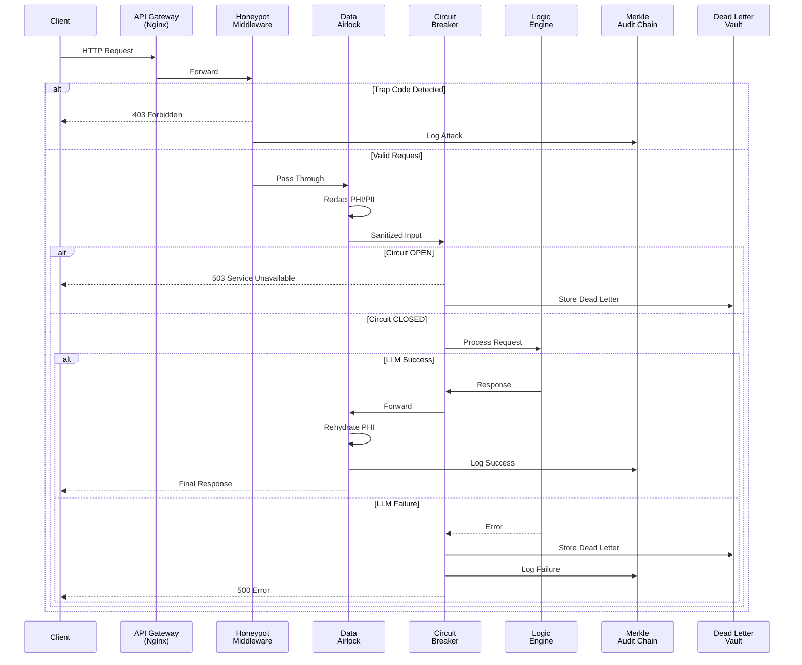

# MathProtocol Architecture

## Overview

MathProtocol is a deterministic control protocol that constrains LLM behavior using predefined mathematical codes. By forcing the LLM to communicate via strict numerical mappings, we eliminate prompt injection vulnerabilities and ensure predictable, auditable behavior.

## Core Principle

**Mathematical Determinism over Natural Language Ambiguity**

Traditional LLM APIs accept arbitrary text prompts and return arbitrary text responses. This creates two critical vulnerabilities:
1. **Prompt Injection**: Malicious users can override system instructions
2. **Output Unpredictability**: LLM responses are non-deterministic and hard to validate

MathProtocol solves both by replacing natural language with mathematical codes.

## Protocol Specification

### Input Format
```
[TASK]-[PARAM] | [CONTEXT]
```

- **TASK**: Prime number (2-97) identifying the operation
- **PARAM**: Fibonacci number (1-89) specifying behavior modifier
- **CONTEXT**: Optional natural language input (the only freeform text)

### Output Format
```
[RESPONSE]-[CONFIDENCE] | [PAYLOAD]
```

- **RESPONSE**: Power of 2 (2-64) indicating result category
- **CONFIDENCE**: Power of 2 (128/256/512) indicating certainty
- **PAYLOAD**: Optional response data (required for generative tasks)

### Mathematical Sets

**Primes (Tasks)**: 2, 3, 5, 7, 11, 13, 17, 19, 23, 29, 31, 37, 41, 43, 47, 53, 59, 61, 67, 71, 73, 79, 83, 89, 97

**Fibonacci (Parameters)**: 1, 2, 3, 5, 8, 13, 21, 34, 55, 89

**Powers of 2 (Responses)**: 2, 4, 8, 16, 32, 64, 128, 256, 512, 1024, 2048, 4096

### Task Categories

**Classification Tasks** (No Payload):
- 2: Sentiment Analysis
- 5: Language Detection
- 13: Classification
- 19: Content Moderation
- 29: Readability Analysis

**Generative Tasks** (Requires Payload):
- 3: Summarization
- 7: Entity Extraction
- 11: Question Answering
- 17: Translation
- 23: Keyword Extraction

## System Architecture

### Data Flow



### Security Zones

#### Zone 1: Edge (Untrusted)
- **Components**: Nginx, Rate Limiting, TLS Termination
- **Purpose**: First line of defense against network attacks
- **Controls**: DDoS protection, SSL/TLS, Request validation

#### Zone 2: Application (Semi-Trusted)
- **Components**: FastAPI, Honeypot Middleware, Request Router
- **Purpose**: Application-level security and routing
- **Controls**: Active defense, Input validation, Authentication

#### Zone 3: Processing (Controlled)
- **Components**: DataAirlock, Circuit Breaker, Protocol Validator
- **Purpose**: Data sanitization and fault isolation
- **Controls**: PHI/PII redaction, Failure containment, Protocol enforcement

#### Zone 4: Logic Engine (Isolated)
- **Components**: LLM API, MockLLM (dev), Response Validator
- **Purpose**: Actual LLM processing in controlled environment
- **Controls**: Sanitized input only, Response validation, No secrets exposure

#### Zone 5: Audit (Immutable)
- **Components**: Merkle Audit Chain, Dead Letter Vault
- **Purpose**: Forensic survivability and compliance
- **Controls**: Tamper-evident logging, Transaction preservation, Chain verification

## Component Details

### DataAirlock (PHI/PII Redaction)

**Purpose**: Zero-trust data handling - LLM never sees sensitive data

**Mechanism**:
1. Scan input for patterns (Email, SSN, MRN, Phone, Credit Card)
2. Replace with deterministic tokens (e.g., `<EMAIL_1>`, `<SSN_1>`)
3. Store mapping in isolated vault
4. After LLM processing, rehydrate tokens back to original values
5. Return final response to user

**Compliance**: HIPAA § 164.514(b), GDPR Article 32

### Honeypot Middleware (Active Defense)

**Purpose**: Detect and neutralize attackers probing the system

**Mechanism**:
1. Designate specific primes (43, 47, 53, etc.) as trap codes
2. These codes are valid protocol primes but not assigned to tasks
3. Any request using trap codes triggers immediate IP ban
4. Sophisticated probes (valid task + canary param) also detected
5. All triggers logged to audit chain

**Compliance**: NIST SI-4 (System Monitoring)

### Circuit Breaker (Fault Isolation)

**Purpose**: Prevent cascade failures when LLM fails

**Mechanism**:
1. Track failure rate of LLM calls
2. After threshold (default 5), trip circuit to OPEN state
3. Reject all requests immediately without calling LLM
4. After timeout (default 60s), enter HALF_OPEN for testing
5. Reset to CLOSED if test succeeds

**Compliance**: NIST SC-7 (Boundary Protection)

### Merkle Audit Chain (Tamper-Evident Logging)

**Purpose**: High-throughput logging with cryptographic integrity

**Mechanism**:
1. Buffer events in memory (default batch size: 10)
2. When buffer full, compute Merkle root of all event hashes
3. Chain Merkle root to previous root via SHA-256
4. Write entire batch to disk in single operation
5. Chain can be verified to detect tampering

**Compliance**: NIST AU-9 (Audit Log Protection)

**Advantages over Linear Logging**:
- Higher throughput (batched writes)
- Lower I/O overhead (fewer disk operations)
- Same tamper-evidence (cryptographic chaining)
- Efficient verification (Merkle proof paths)

### Dead Letter Vault (Forensic Survivability)

**Purpose**: Preserve failed transactions for analysis

**Mechanism**:
1. When LLM fails or circuit breaker trips
2. Serialize full request context (input, IP, timestamp)
3. Capture complete error (type, message, stack trace)
4. Write as JSON to vault directory
5. Available for replay or forensic analysis

**Compliance**: NIST AU-11 (Audit Record Retention)

## Deployment Architecture

### Development
```
Client → http://localhost:8000 → FastAPI (server.py)
```

### Production (Docker Compose)
```
Client → http://localhost:80 → Nginx (gateway)
       ↓
       → http://aegis-api:8000 → FastAPI (server.py)
```

### Enterprise (Kubernetes)
```
Client → LoadBalancer (TLS) → Ingress (WAF)
       ↓
       → Service (aegis-api) → Pod 1
                             → Pod 2
                             → Pod N
```

## Security Properties

### Confidentiality
- PHI/PII never exposed to LLM
- Secrets isolated in DataAirlock vault
- TLS encryption in transit

### Integrity
- Merkle chain prevents log tampering
- Protocol validation prevents malformed inputs
- Response validation prevents invalid outputs

### Availability
- Circuit breaker prevents resource exhaustion
- Rate limiting prevents DDoS
- Dead letter vault preserves failed transactions

### Accountability
- All requests logged to audit chain
- Chain cryptographically verifiable
- Failed requests preserved with full context

### Non-Repudiation
- Merkle roots are cryptographic commitments
- Chain links provide temporal ordering
- Cannot modify logs without detection

## Performance Characteristics

### Latency Overhead
- DataAirlock: ~1-2ms (regex scanning)
- Honeypot: <1ms (code check)
- Circuit Breaker: <1ms (state check)
- Audit Chain: <1ms (memory buffer)
- Total: ~3-5ms overhead

### Throughput
- Batch writing (Merkle): 1000+ events/second
- Circuit breaker: Prevents overload
- Async processing: Non-blocking I/O

### Scalability
- Stateless application tier (horizontal scaling)
- Shared vault (Redis/DB in production)
- Distributed logging (Kafka in production)

## Future Enhancements

### V2.0 Roadmap
- [ ] Distributed Merkle forest (multi-node)
- [ ] Zero-knowledge audit proofs
- [ ] Real-time anomaly detection (ML)
- [ ] Adaptive honeypot generation
- [ ] Hardware security module (HSM) integration

### V3.0 Roadmap
- [ ] Blockchain integration for public auditability
- [ ] Multi-party computation (MPC) for secrets
- [ ] Federated learning for attack patterns
- [ ] Quantum-resistant cryptography

## References

1. NIST SP 800-53 Rev 5 - Security Controls
2. HIPAA Security Rule - 45 CFR § 164.312
3. OWASP LLM Top 10 - LLM01 (Prompt Injection)
4. Merkle, R.C. (1980) - Protocols for Public Key Cryptosystems
5. Martin Fowler - Circuit Breaker Pattern

## Glossary

**PHI**: Protected Health Information
**PII**: Personally Identifiable Information
**Merkle Tree**: Binary tree of cryptographic hashes
**Circuit Breaker**: Fault tolerance pattern
**Dead Letter**: Failed message queue entry
**Honeypot**: Decoy system to detect attackers
**Zero-Trust**: Security model assuming breach
